## Live link:
https://taxiwebsitenew.web.app

## GitHub repo link:
https://github.com/70149418-ops/taxiWebsiteNew.git

## File Structure:
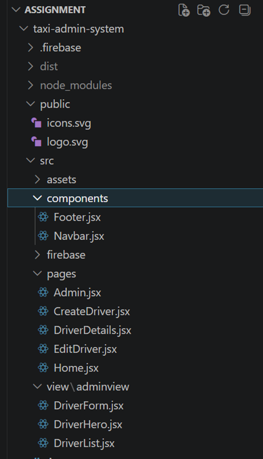

## Logo:

## Home:
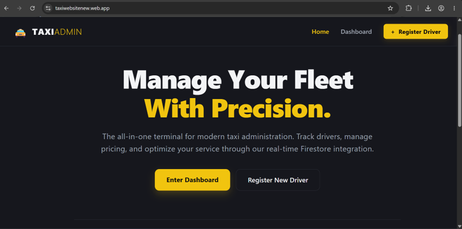

## Dashboard:
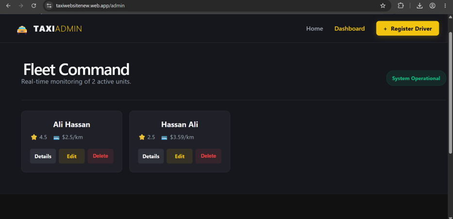

## Create Driver:
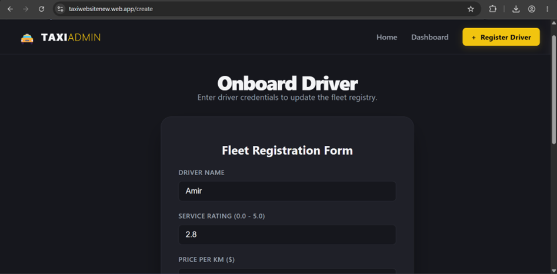
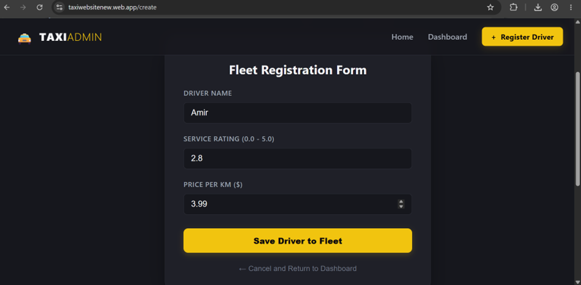
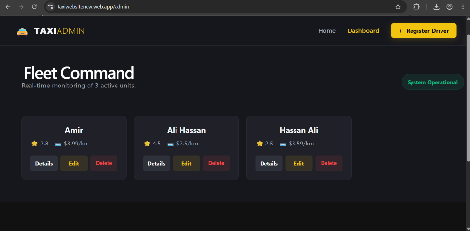

## Read Driver:
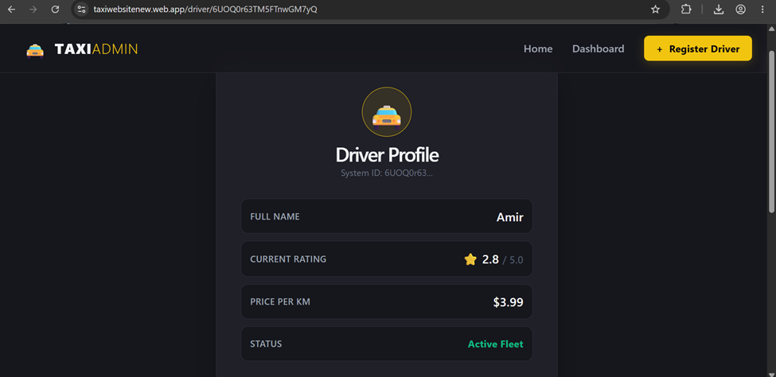
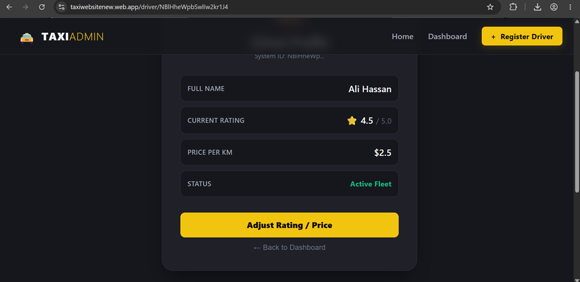

## Update Driver:
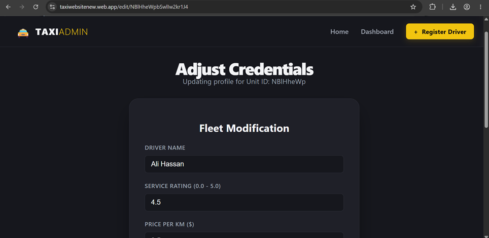
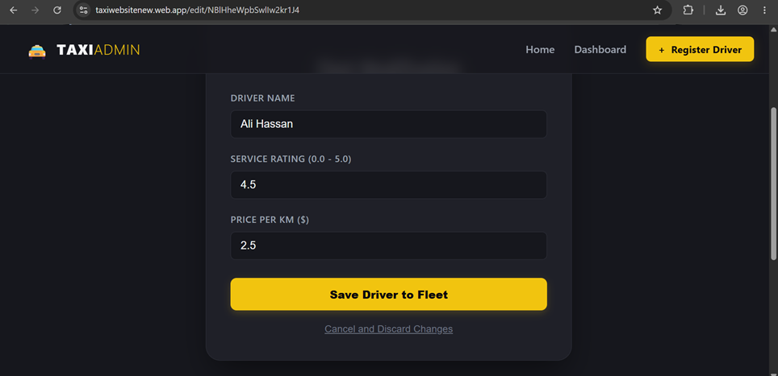

## Delete Driver:
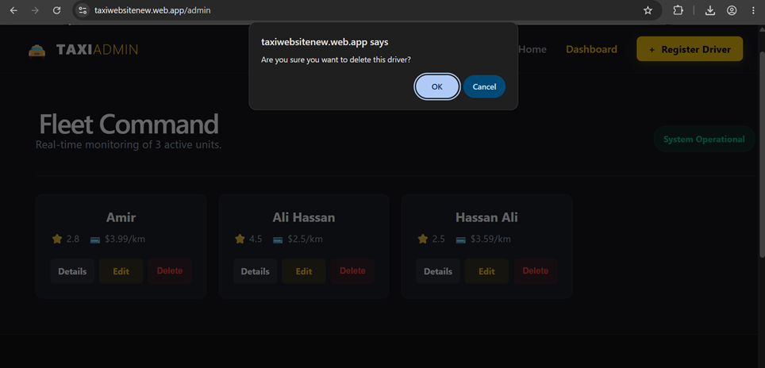

## Dynamic Route Page:
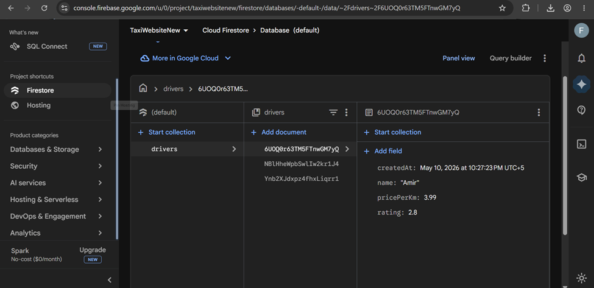